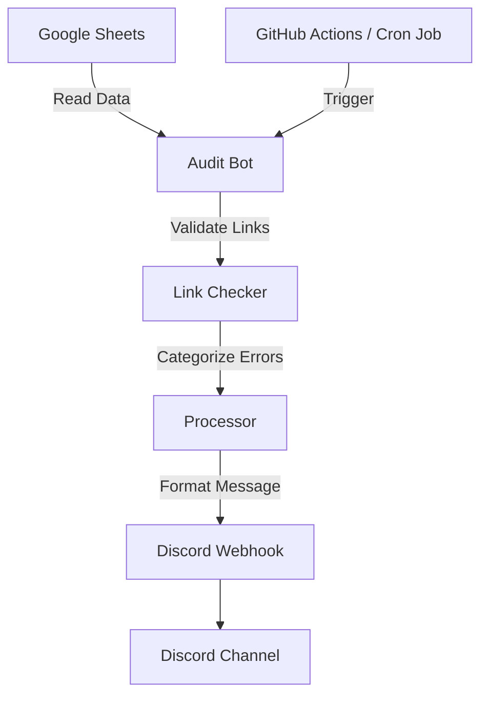

# 🚀 App Links Audit Bot

A scalable and automated auditing system designed to monitor App Store and Web
links across multiple Google Sheets. The bot detects broken, restricted, or
policy-violating links and delivers structured, real-time alerts to Discord.

---

## 🎯 Purpose

This tool helps teams:

- Detect broken or removed app links early
- Monitor policy-related issues across multiple sources
- Reduce manual checking effort
- Centralize alerting in Discord for fast response

---

## ✨ Key Features

### 🔍 Smart Auditing

- Scan multiple Google Sheets in one run
- Detect:
  - Policy Down links
  - WebStore errors
  - Invalid or unreachable URLs

### 🧩 Multi-Sheet Support

- Works with multiple sheets simultaneously
- Example:
  - Product Auto
  - Titan

### 📊 Clean Discord UI

- Compact embed format (no overflow)
- Grouped by error type
- One-line link display for readability

### ⏱ Automated Execution

- Runs every 15 minutes
- Supports:
  - GitHub Actions
  - External Cron Jobs (recommended for real-time)

### 🔗 Optimized Link Format

- No-wrap display:
  - App Name + Sheet Tag + Store + Direct Link

---

## 🏗 Architecture Overview



### Flow Explanation

1. Scheduler triggers the bot (GitHub Actions / Cron Job)
2. Bot reads data from Google Sheets
3. Links are validated (status, accessibility, policy issues)
4. Results are categorized
5. A structured report is sent to Discord

---

## 📁 Project Structure

```
automated-audit/
│── src/
│   ├── index.js           # Entry point
│   └── credentials.json   # Google service account key
│
│── .github/workflows/     # GitHub Actions config
│── .env                   # Environment variables
│── package.json
│── README.md
```

---

## ⚙️ Setup & Installation

### 1. Prerequisites

- Node.js (v18+)
- Google Cloud Service Account
- Google Sheet access granted to service account
- Discord Webhook URL

---

### 2. Local Setup

Clone repository:

```bash
git clone https://github.com/tamnvt-bblvn/automated-audit.git
cd automated-audit
```

Install dependencies:

```bash
npm install
```

Create `.env` file:

```env
SPREADSHEET_ID=your_spreadsheet_id
SHEET_NAMES=Product Auto,Titan
DATA_RANGE=C2:D100
DISCORD_WEBHOOK_URL=your_webhook_url
```

Add credentials:

- Place your Google Service Account file at:

```
src/credentials.json
```

---

### 3. Run Locally

```bash
npm run start
```

---

## ⚙️ GitHub Actions Setup

### Add Repository Secrets

Go to: Settings → Secrets and variables → Actions

Add:

- SHEET_NAMES → Full JSON content
- DISCORD_WEBHOOK_URL → Your webhook URL
- SPREADSHEET_ID → Your sheet id
- DATA_RANGE → Range you want read

---

### Configure Workflow

Edit:

```
.github/workflows/main.yml
```

Update:

- SPREADSHEET_ID
- SHEET_NAMES
- DATA_RANGE

---

## 📊 Discord Output Example

```
📂 POLICY DOWN
- App A [Product] 🔗 Store | Link

📂 WEBSTORE ERROR
- App B [Titan] 🔗 Store | Link
```

---

## 🧪 Troubleshooting

### Missing Sheet Tags

Ensure `sheetName` is correctly passed when building the error list.

### Broken Links Not Showing

- Verify URLs start with `http` or `https`
- Check for malformed data in Google Sheets

### Delayed Execution

- GitHub Actions (Free tier): delay 10–45 minutes
- Use [https://cron-job.org](https://cron-job.org) for near real-time triggering

---

## 🚀 Future Improvements

- Retry mechanism for unstable links
- Dashboard UI (instead of Discord-only)
- Database logging (history tracking)
- Alert deduplication

---

## 👨‍💻 Maintainer

**tamnvt-bblvn**

---

## 📅 Last Updated

2026
